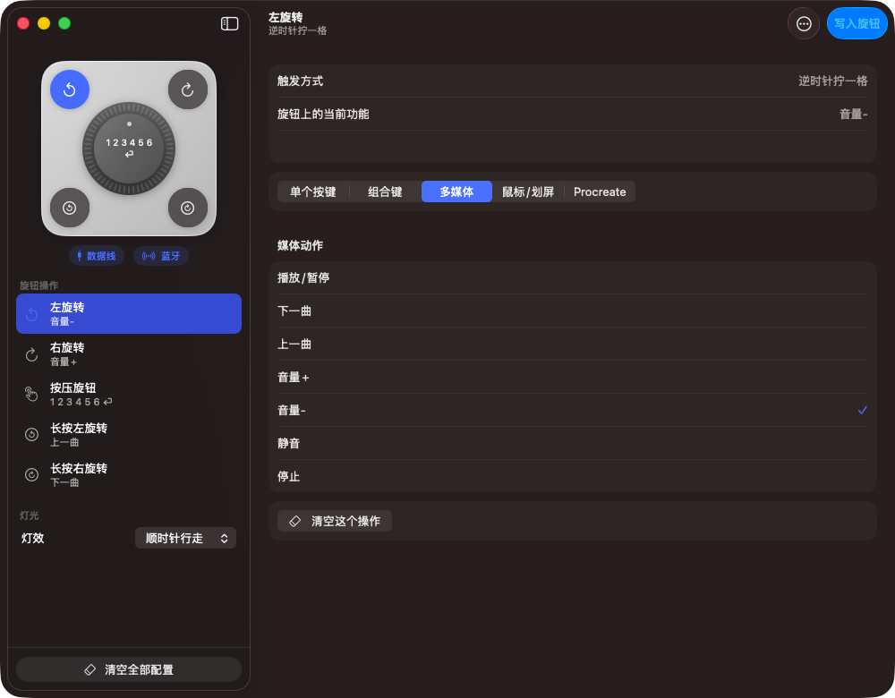
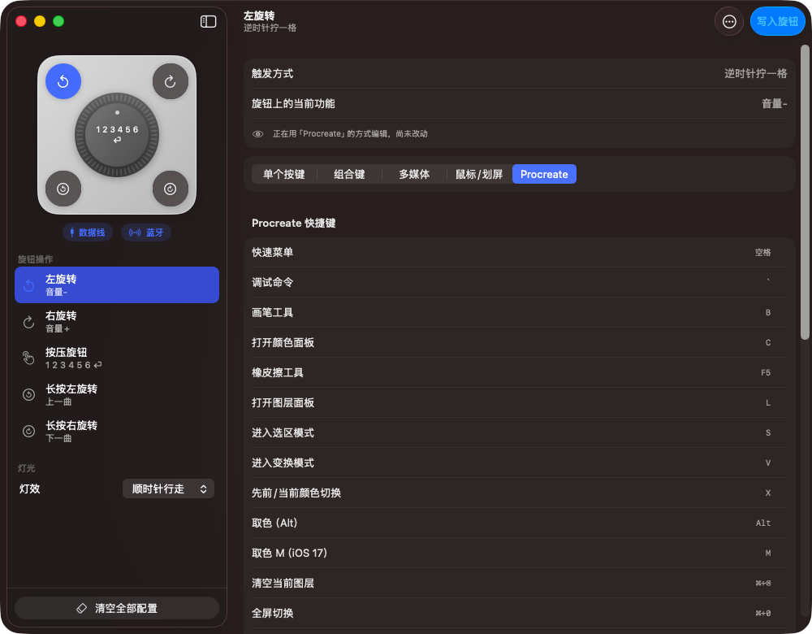

# AntiCater for Mac

[简体中文](README.md)

A native macOS configuration tool for the ANTICATER desktop volume knob. Built on top of the original app: the feature set and the wire protocol match it, but the code is a clean reimplementation in Swift + SwiftUI and contains none of the original source or binaries.

The original app ships as an x86_64-only Qt program and therefore depends on Rosetta 2 on Apple Silicon, which is being removed in macOS 28. This project provides a native arm64 implementation with an interface redesigned to follow macOS conventions.

Version 1.1 · Requires macOS 13 or later · Noncommercial use only

---



## Features

All five physical knob actions can be configured: rotate left, rotate right, press, long-press rotate left, long-press rotate right. Each action supports:

| Type | Description |
|---|---|
| Single key | Any keyboard key, with multi-step sequences and delays |
| Key combination | Any mix of Ctrl / Shift / Alt / Command |
| Media | Volume, playback and other Consumer-page functions |
| Mouse | Mouse buttons, scroll wheel, four-direction swipe, like |
| Procreate | The 31 presets from the corresponding page of the original app (see the note below) |

Lighting-mode switching, a menu bar item and launch-at-login are also supported.

Configuration is stored in the knob's own firmware. Once written, this app does not need to keep running, and the configuration follows the knob to another computer. This app only writes the configuration.



## Installation

Download the DMG from [Releases](../../releases) and drag the app into Applications.

The app is ad-hoc signed. There is no Apple Developer certificate and it is not notarized, so Gatekeeper will block the first launch. Right-click the icon, choose Open, then click Open again in the system dialog — double-clicking will not get through.

No privacy permissions such as Input Monitoring are required: the configuration channel lives on the vendor-defined usage page `0xFF00`, not the keyboard page.

## Usage

A USB cable is required to change the configuration. The Bluetooth side is a separate HID device and does not expose the `0xFF00` configuration interface.

Pick a knob action on the left, choose a type and adjust its settings on the right, then commit with "写入旋钮" (Write to knob) in the top-right corner. Edits are staged and can be discarded at any point before committing; after writing, the app reads the configuration back and verifies it, listing explicitly anything that did not take effect.

If the cable is unplugged mid-session the app disconnects and keeps your staged edits, then reconnects automatically when it is plugged back in.

## Network activity

The only network activity in this app is the update check: it asks GitHub's public API for the latest release tag of this repository and compares it against the running version. The request carries no identifying information and reports nothing about the machine.

It can be turned off with "启动时检查更新" (Check for updates at launch) in the menu bar panel, after which requests are only made when "检查更新" is clicked manually. Nothing else in this app talks to the network.

## Building

```bash
swift build -c release
./make-app.sh          # build the .app
./make-dmg.sh          # build the DMG
./Tools/make-icon.sh   # regenerate the icon (only needed after editing make-icon.swift)
DEVELOPER_DIR=/Applications/Xcode.app/Contents/Developer swift test
```

`DEVELOPER_DIR` must be set to run the tests: if `xcode-select -p` points at CommandLineTools, XCTest is not present there.

`Sources/AntiCaterCore/Version.swift` is the single source of truth for the version number; `make-app.sh` reads it when filling in Info.plist, and releases should be tagged with the same value.

## Project layout

```
Sources/
  AntiCaterCore/     protocol codec, HID transport, link monitoring, update check (no UI dependency)
  AntiCaterUI/       SwiftUI views and DeviceModel
  AntiCaterApp/      executable target, main.swift only
  anticater-dump/    CLI tool that dumps the current configuration
  anticater-restore/ recovery tool; unconditionally overwrites the rotate bindings — read the source comments first
Tests/
  AntiCaterCoreTests/  protocol codec and version comparison
  AntiCaterUITests/    DeviceModel state machine, using a fake device to simulate unplugs and write failures
Tools/               icon generation scripts
```

The UI is a separate library target (`AntiCaterUI`) rather than living directly in the executable for one reason only: SwiftPM cannot use an executableTarget as a test dependency, and `DeviceModel` needs to be testable.

## Protocol notes

The device protocol is undocumented; this implementation is based on observing the traffic of the author's own device. The configuration interface is VID `0x514C` / PID `0x8850`, HID usage page `0xFF00` usage `0x01`, Report ID 3, with fixed 64-byte payloads in both directions.

Some of the numbering is inferred rather than verified. The source comments annotate the provenance of each item; two of them warrant mention here:

- `Proto.mouseActions`: the four swipe direction codes were derived from the ordering of the list, and three modifier combinations were derived from the symmetric entry of the same modifier.
- `Proto.procreatePresets`: the 31 key codes are verified; the mapping between key codes and names is inferred, and only the first and last entries (⌘] zoom in 1%, ⌘Z undo) were independently verified. Treat the key codes, not the labels, as authoritative.

No firmware update or flashing functionality is implemented in this project.

## Disclaimer

This is an unofficial implementation. It is not affiliated with or endorsed by the ANTICATER vendor, and contains no code or binaries from the original app.

If the vendor considers anything here inappropriate, please get in touch via an issue and this project will cooperate.

Any consequences of using this software to modify your knob's configuration are the user's own responsibility.

## License

[PolyForm Noncommercial License 1.0.0](LICENSE). Use, modification and distribution are permitted for personal use, study, research and other noncommercial purposes; commercial use is not granted.
